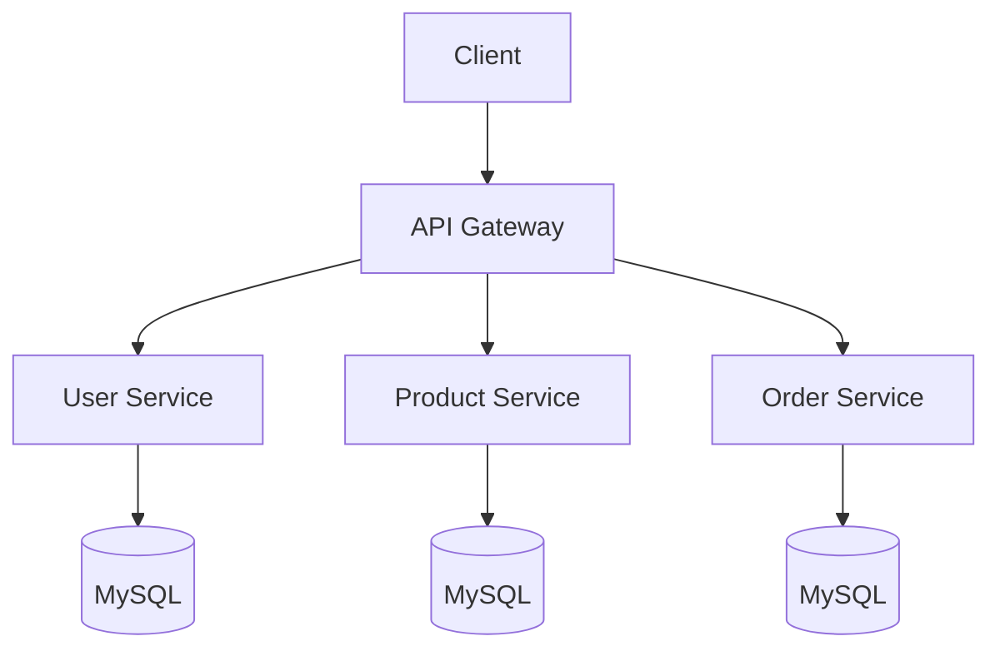

# Buyzy E-commerce Platform 🛍️

[](https://github.com/yourusername/buyzy)
[](https://www.docker.com/)
[](https://kubernetes.io/)

## 📋 Table of Contents
- [Overview](#overview)
- [System Architecture](#system-architecture)
- [Technology Stack](#technology-stack)
- [Deployment Guide](#deployment-guide)
- [CI/CD Pipeline](#cicd-pipeline)
- [Monitoring & Logging](#monitoring--logging)
- [Local Development](#local-development)
- [Future Development](#future-development)
- [Special Thanks](#special-thanks)

## Overview

Buyzy is a modern e-commerce platform built using microservices architecture. The system is designed to be scalable, maintainable, and highly available, leveraging Kubernetes for orchestration and containerization.

### Core Services

- **User Service**: Handles user authentication, and profile management
- **Product Service**: Manages product catalog, inventory, and categories, manages shopping cart functionality
- **Order Service**: Processes orders, order history, and order status, handles payment processing and transactions
- **API Gateway**: Single entry point for all client requests, handle user authentication

## System Architecture



## Technology Stack

### Backend
- Spring Boot 3.x
- Spring Security
- Spring Data JPA
- JWT Authentication
- Spring Cloud Gateway
- Spring Cloud Config
### Database
- MySQL
### Infrastructure
- Kubernetes (Minikube)
- Docker
- Jenkins (CI/CD)
- Prometheus & Grafana (Monitoring)
- Loki (Logging)

## Deployment Guide

### Prerequisites
- Docker
- Minikube
- kubectl
- Helm

### Setting up Minikube

```bash
# Start Minikube
$ minikube start --driver=docker
```


### Deploying Services

```bash
# Apply configurations
$ kubectl apply -f  ~/Buyzy/k8s/secrets/
$ kubectl apply -f ~/Buyzy/k8s/manifests/
```

## CI/CD Pipeline

The CI/CD pipeline is implemented using Jenkins and includes the following stages:
1. **Checkout Code**

2. **Verify Docker and Kubectl**

3. **Check for changes**

4. **Buil Docker Images**

5. **Push to registry**

6. **Deploy to Kubernetes**

### Jenkinsfile Example

```groovy
pipeline {
    agent any
    environment {
      IMAGE_NAME = "thinhnguet/api-gateway"
      IMAGE_TAG = "latest"
    }
    stages {
        stage('Checkout Code') {
            steps {
                git branch: 'main', url: 'https://github.com/thinhuet2022/Buyzy.git'
            }
        }
        stage('Verify Docker and Kubectl') {
            steps {
                sh 'docker version'
                sh 'kubectl config current-context'
                sh 'kubectl get nodes'
            }
        }
        stage('Check for changes') {
          steps {
            script {
              sh 'git fetch origin main'
              def previousCommit = sh(script: "git rev-parse origin/main~1", returnStdout: true).trim()
                   def currentCommit = sh(script: "git rev-parse origin/main", returnStdout: true).trim()

                   echo "Comparing commits: $previousCommit → $currentCommit"

                   // Diff giữa 2 commit
                   def changes = sh(
                     script: "git diff --name-only ${previousCommit} ${currentCommit}",
                     returnStdout: true
                   ).trim()

                   echo "Changed files:\n$changes"
              if (!changes.contains('backend/api-gateway/')) {
                echo "No changes in frontend. Skipping build."
                currentBuild.result = 'NOT_BUILT'
                error("Skipped.")
              }
            }
          }
        }
        stage('Build Docker Images for API Gateway') {
            steps {
                script {

                    // Build the Docker image
                    sh "docker build -t $IMAGE_NAME:$IMAGE_TAG ./backend/api-gateway"
                }
            }
        }
        stage('Push Docker Images to Docker Hub') {
            steps {
                withCredentials([usernamePassword(credentialsId: 'dockerhub-creds', usernameVariable: 'DOCKER_USER', passwordVariable: 'DOCKER_PASS')]) {
                    sh """
                        echo $DOCKER_PASS | docker login -u $DOCKER_USER --password-stdin
                        docker push $IMAGE_NAME:$IMAGE_TAG
                    """
                }
            }
        }
        stage('Deploy to Kubernetes') {
            steps {
                script {
                    // Deploy the Docker image to Kubernetes
                    sh """
                        kubectl set image deployment/api-gateway api-gateway=$IMAGE_NAME:$IMAGE_TAG --namespace=default
                    """
                }
            }
        }
    }
}
```

## Monitoring & Logging

### Prometheus & Grafana Setup

```bash
# Install Prometheus
$ kubectl create namespace monitoring
$ helm repo add prometheus-community https://prometheus-community.github.io/helm-charts
$ helm install prometheus prometheus-community/kube-prometheus-stack -n monitoring

$ helm install mysql-exporter-1 prometheus-community/prometheus-mysql-exporter \
  --namespace monitoring \
  --values ~/Buyzy/k8s/values/mysql-user-values.yaml

# Truy cập vào CLI của từng pod chạy db, vào tạo user exporter
$ mysql -h 127.0.0.1 -u root -p
$ CREATE USER 'exporter'@'%' IDENTIFIED BY 'password';
$ GRANT PROCESS, REPLICATION CLIENT, SELECT ON *.* TO 'exporter'@'%';
$ FLUSH PRIVILEGES;

# Access Grafana
$ kubectl port-forward svc/prometheus-grafana 3000:80
```

### Loki Setup

```bash
# Install Loki, install promtail to send logs to Loki
$ kubectl create namespace logging
$ helm repo add grafana https://grafana.github.io/helm-charts
$ helm install loki grafana/loki-stack \
                           -n logging \
                             --set promtail.enabled=true \
                             --set grafana.enabled=false \
                             --set prometheus.enabled=false

# Add Loki as a new datasource to grafana
$ helm upgrade prometheus prometheus-community/kube-prometheus-stack \
          -n monitoring \
          -f ~/Buyzy/monitoring/loki.yaml \
          --set grafana.additionalDataSources[0].name=Loki \
          --set grafana.additionalDataSources[0].type=loki \
          --set grafana.additionalDataSources[0].url=http://loki.logging.svc.cluster.local:3100 \
          --set grafana.additionalDataSources[0].access=proxy


```


## Local Development

### Prerequisites
- Java 21
- Maven 4.0
- Docker
- Docker Compose

### Running Services Locally

```bash
# Start all services
$ docker-compose up -d

```

### Development Environment Setup

1. Clone the repository
2. Install dependencies
3. Configure environment variables(create a .env file(contact author for more details))
4. Run services in development mode


### Important Environment Variables
```bash
# Email settings
GMAIL_USERNAME='your_email'
GMAIL_PASSWORD='your_application_pwd'

# Cloudinary settings
CLOUDINARY_CLOUD_NAME='your_cloud_name'
CLOUDINARY_API_KEY='your_api_key'
CLOUDINARY_API_SECRET='your_api_secret'

# Payment VNPAY settings
VNPAY_URL=https://sandbox.vnpayment.vn/paymentv2/vpcpay.html
VNPAY_TMN_CODE=OW8Y2T76
VNPAY_HASH_SECRET=DHLD7XUZYON4IJWCHBGKTB2712C6ZS4U
VNPAY_RETURN_URL=http://localhost:8080/api/v1/payment/vn-pay-return
PAYMENT_RESULT_URL=http://localhost:3000/payment-result

```
## Future Development

- **Advanced Search**: AI-powered search with recommendations
- **Inventory Management**: Real-time inventory tracking and automated reordering
- **Analytics Dashboard**: Business intelligence and reporting features
- **Deploying to cloud**: deploying application to cloud environment like EKS, GKE
- **OAuth 2.0 Integration**: Social login with Google, Facebook, GitHub
- **HPA**: Automatically scaling services based on work loads using HPA
- **API Rate Limiting**: Advanced rate limiting and throttling
- **Message Queues**: Event-driven architecture with Apache Kafka


## Special Thanks

- **[Supervisor/TS Tran Truc Mai]** - For providing the inspiring idea for this e-commerce microservices project and guiding the development process with valuable insights and mentorship.

